# Arena360 Client Handover Guide (English + العربية)

This guide is written for first-time users and handover teams.
It follows the real order of work from user creation to final report export.

---

## Index | الفهرس

1. [Full Journey Map | مخطط الرحلة الكاملة](#1-full-journey-map--مخطط-الرحلة-الكاملة)
2. [Create New User Account (Admin) | إنشاء مستخدم جديد (المسؤول)](#2-create-new-user-account-admin--إنشاء-مستخدم-جديد-المسؤول)
3. [Post-User-Creation Lifecycle | دورة ما بعد إنشاء المستخدم](#3-post-user-creation-lifecycle--دورة-ما-بعد-إنشاء-المستخدم)
4. [Login | تسجيل الدخول](#4-login--تسجيل-الدخول)
5. [Add First Client | إضافة أول عميل](#5-add-first-client--إضافة-أول-عميل)
6. [Assign Members to Client | تعيين أعضاء للعميل](#6-assign-members-to-client--تعيين-أعضاء-للعميل)
7. [Create First Project | إنشاء أول مشروع](#7-create-first-project--إنشاء-أول-مشروع)
8. [Project Tabs Guide | شرح تبويبات المشروع](#8-project-tabs-guide--شرح-تبويبات-المشروع)
9. [Tasks: Add, Assign, Update Status | المهام: إضافة وتعيين وتحديث الحالة](#9-tasks-add-assign-update-status--المهام-إضافة-وتعيين-وتحديث-الحالة)
10. [Milestones: Add and Track | المعالم: إضافة ومتابعة](#10-milestones-add-and-track--المعالم-إضافة-ومتابعة)
11. [Add Findings in Report | إضافة الملاحظات في التقرير](#11-add-findings-in-report--إضافة-الملاحظات-في-التقرير)
12. [Generate AI Summary | إنشاء الملخص الذكي](#12-generate-ai-summary--إنشاء-الملخص-الذكي)
13. [Export Report PDF | تصدير التقرير PDF](#13-export-report-pdf--تصدير-التقرير-pdf)
14. [Advanced: Report Template Management | متقدم: إدارة قالب التقرير](#14-advanced-report-template-management--متقدم-إدارة-قالب-التقرير)
15. [Advanced: Workspace Tabs Template Management | متقدم: إدارة قالب تبويبات مساحة العمل](#15-advanced-workspace-tabs-template-management--متقدم-إدارة-قالب-تبويبات-مساحة-العمل)
16. [Role Matrix (Who Can Do What) | مصفوفة الأدوار (من يستطيع ماذا)](#16-role-matrix-who-can-do-what--مصفوفة-الأدوار-من-يستطيع-ماذا)
17. [Final Handover Checklist | قائمة التحقق النهائية للتسليم](#17-final-handover-checklist--قائمة-التحقق-النهائية-للتسليم)
18. [Troubleshooting | حل المشاكل](#18-troubleshooting--حل-المشاكل)

---

## 1) Full Journey Map | مخطط الرحلة الكاملة

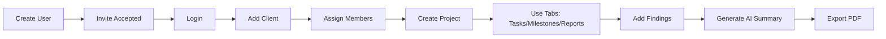

---

## 2) Create New User Account (Admin) | إنشاء مستخدم جديد (المسؤول)

### EN
Recommended role to perform this step: `SUPER_ADMIN`.

1. Open `Admin > Users`.
2. Click `Add User`.
3. Fill full name, email, and role.
4. If user is client-side, choose client organization.
5. Click `Create`.
6. System sends invite email (and backup invite link is available).

### العربية
الدور الموصى به لتنفيذ هذه الخطوة: `SUPER_ADMIN`.

1. افتح `الإدارة > المستخدمون`.
2. اضغط `إضافة مستخدم`.
3. أدخل الاسم الكامل، البريد الإلكتروني، والدور.
4. إذا كان المستخدم من طرف العميل، اختر جهة العميل.
5. اضغط `إنشاء`.
6. النظام يرسل دعوة عبر البريد (مع رابط احتياطي عند الحاجة).
   
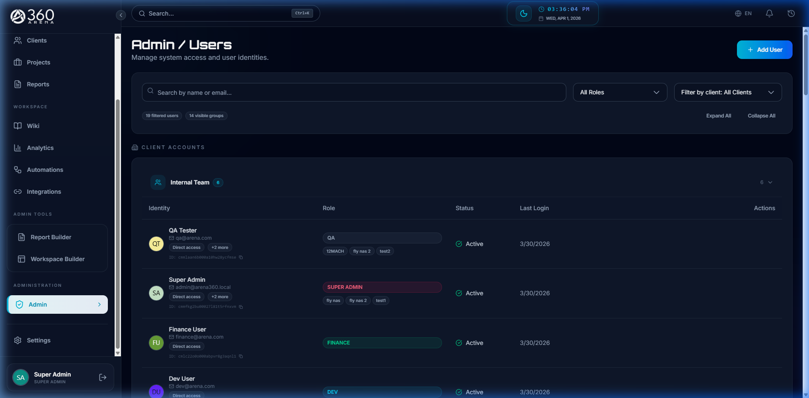
*Admin Users List | قائمة المستخدمين*

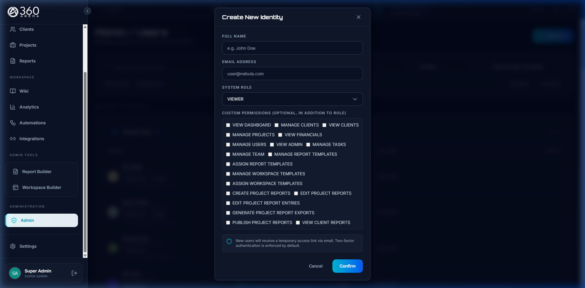
*Add User Modal | نافذة إضافة مستخدم*

---

## 3) Post-User-Creation Lifecycle | دورة ما بعد إنشاء المستخدم

### EN
What happens after admin creates user:

1. User receives invite.
2. User opens invite link.
3. User sets password and activates account.
4. User logs in.
5. User gets access based on role and assignments.

Status tracking in Users page:
- `Invite pending`
- `Invite expired`
- `Setup complete`

Recovery flow:
1. Check account is active.
2. Confirm role and client assignment.
3. Resend invite.
4. Share backup invite link securely if needed.

### العربية
ماذا يحدث بعد إنشاء المستخدم:

1. المستخدم يستلم الدعوة.
2. يفتح رابط الدعوة.
3. يحدد كلمة المرور ويفعّل الحساب.
4. يسجل الدخول.
5. يحصل على صلاحياته حسب الدور والتعيين.

حالات المتابعة في صفحة المستخدمين:
- `دعوة معلقة`
- `دعوة منتهية`
- `تم إعداد الحساب`

خطوات المعالجة عند المشكلة:
1. تأكد أن الحساب نشط.
2. تأكد من الدور وربط العميل.
3. أعد إرسال الدعوة.
4. استخدم رابط الدعوة الاحتياطي بشكل آمن عند الحاجة.

---

## 4) Login | تسجيل الدخول

### EN
1. Open Arena360 URL.
2. Enter email and password.
3. Click `Login`.

### العربية
1. افتح رابط منصة Arena360.
2. أدخل البريد الإلكتروني وكلمة المرور.
3. اضغط `تسجيل الدخول`.

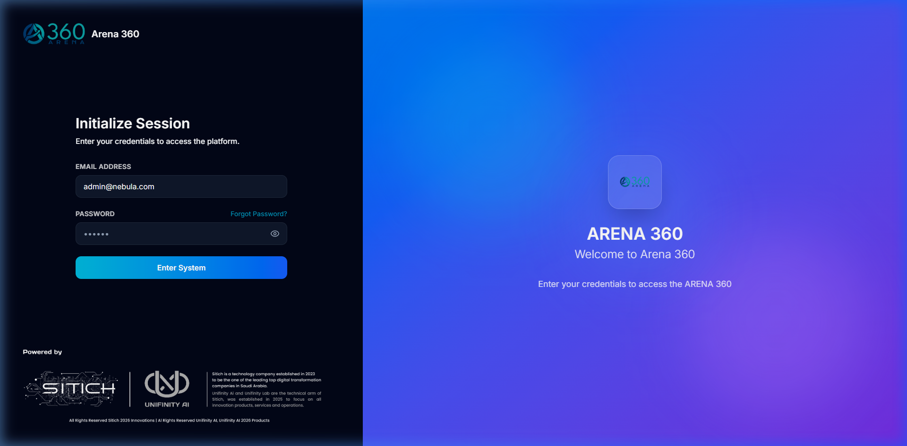
*Login Page | صفحة تسجيل الدخول*

---

## 5) Add First Client | إضافة أول عميل

### EN
Recommended role: `SUPER_ADMIN` or role with `MANAGE_CLIENTS`.

1. Go to `Clients`.
2. Click `Add Client`.
3. Fill client profile details.
4. Save.

Note: System can auto-assign default active accessibility report template to new client if available.

### العربية
الدور الموصى به: `SUPER_ADMIN` أو دور لديه صلاحية `MANAGE_CLIENTS`.

1. اذهب إلى `العملاء`.
2. اضغط `إضافة عميل`.
3. أدخل بيانات العميل.
4. احفظ.

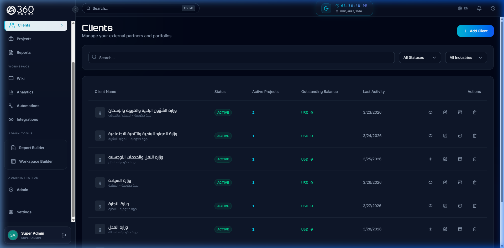
*Clients List | قائمة العملاء*

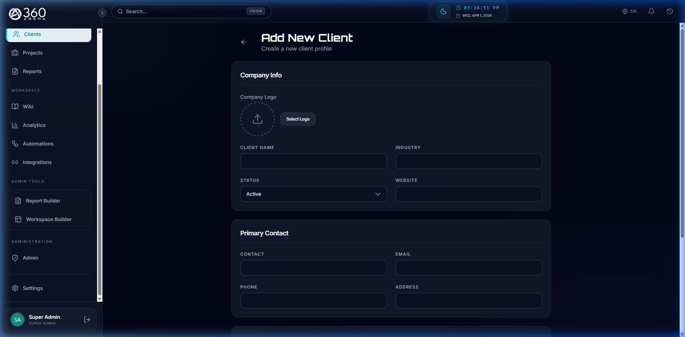
*Add Client Form | نموذج إضافة عميل*

ملاحظة: يمكن للنظام إسناد قالب تقرير إمكانية الوصول الافتراضي للعميل الجديد تلقائيًا إذا كان متوفرًا.

---

## 6) Assign Members to Client | تعيين أعضاء للعميل

### EN
1. Open client profile.
2. Open team/members area.
3. Add members.
4. Assign correct client role:
   - `CLIENT_OWNER`
   - `CLIENT_MANAGER`
   - `CLIENT_MEMBER`
5. Save.

### العربية
1. افتح ملف العميل.
2. افتح منطقة الفريق/الأعضاء.
3. أضف الأعضاء.
4. اختر الدور الصحيح:
   - `CLIENT_OWNER`
   - `CLIENT_MANAGER`
   - `CLIENT_MEMBER`
5. احفظ.

---

## 7) Create First Project | إنشاء أول مشروع

### EN
Recommended role: `SUPER_ADMIN`, `OPS`, or `PM` (with project permissions).

1. Go to `Projects > Create Project`.
2. Select client.
3. Fill project info (name, dates, status, budget).
4. Choose workspace template.
5. Save.

### العربية
الدور الموصى به: `SUPER_ADMIN` أو `OPS` أو `PM` (مع صلاحيات المشروع).

1. اذهب إلى `المشاريع > إنشاء مشروع`.
2. اختر العميل.
3. أدخل بيانات المشروع (الاسم، التواريخ، الحالة، الميزانية).
4. اختر قالب مساحة العمل.
5. احفظ.

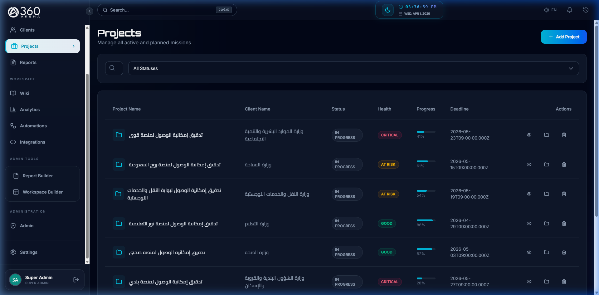
*Projects List | قائمة المشاريع*

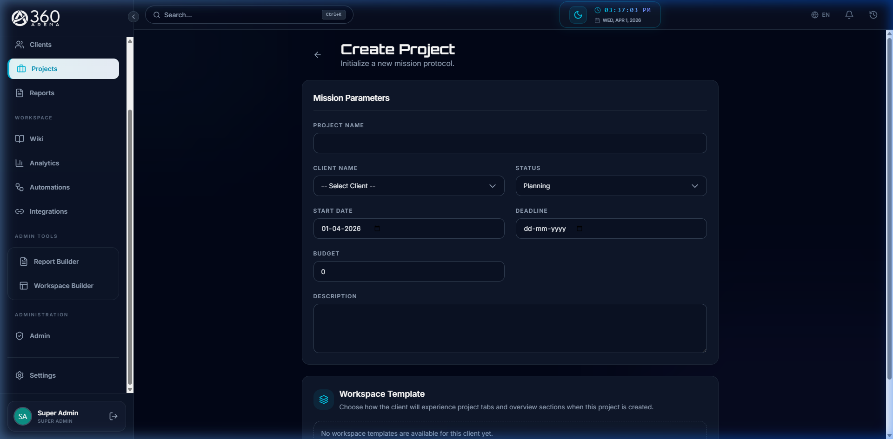
*Create Project Form | نموذج إنشاء مشروع*

---

## 8) Project Tabs Guide | شرح تبويبات المشروع

Important: visible tabs depend on role and assigned workspace template.

### EN (Purpose of each tab)
| Tab | Purpose |
|---|---|
| Overview | Project summary, health, KPIs, latest activity |
| Discussions | Team conversations and threaded replies |
| Tasks | Task list/kanban, assignment, status tracking |
| Milestones | Major checkpoints and progress gates |
| Updates | Progress updates for stakeholders |
| Timeline | Time-sequenced project planning view |
| Sprints | Sprint planning and execution cycles |
| Reports | Audit/report workspaces and outputs |
| Findings | Quality/accessibility findings tracking |
| Time | Time logging against tasks |
| Recurring | Recurring task templates and automation |
| Files | Shared project files |
| Team | Project member management |
| Financials | Contracts, invoices, financial health |
| Testing Access | QA/testing credentials and references |
| Activity | Detailed project event log |

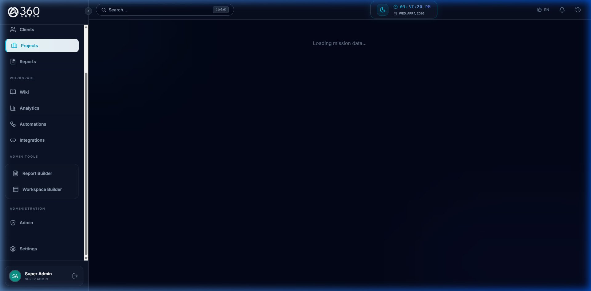
*Project Overview Tab | تبويب نظرة عامة*

### العربية (الغرض من كل تبويب)
| التبويب | الغرض |
|---|---|
| Overview | ملخص المشروع وصحته ومؤشراته وآخر النشاطات |
| Discussions | مناقشات الفريق والردود المتسلسلة |
| Tasks | قائمة/كانبان المهام والتعيين ومتابعة الحالة |
| Milestones | المعالم الرئيسية ونقاط التحقق |
| Updates | تحديثات التقدم لأصحاب المصلحة |
| Timeline | عرض زمني لتخطيط المشروع |
| Sprints | تخطيط وتنفيذ دورات السبرنت |
| Reports | مساحات عمل التقارير ومخرجاتها |
| Findings | تتبع الملاحظات الفنية/الوصول |
| Time | تسجيل الوقت على المهام |
| Recurring | قوالب المهام المتكررة |
| Files | ملفات المشروع المشتركة |
| Team | إدارة أعضاء المشروع |
| Financials | العقود والفواتير والحالة المالية |
| Testing Access | بيانات وصول الاختبار والمراجع |
| Activity | سجل نشاط تفصيلي للمشروع |

---

## 9) Tasks: Add, Assign, Update Status | المهام: إضافة وتعيين وتحديث الحالة

### EN
### A) Add task
1. Open project.
2. Go to `Tasks`.
3. Click `Add Task`.
4. Fill title, priority, due date, description.
5. Save.

### B) Assign to member
1. Open task edit.
2. Select assignee from project team.
3. Save.

### C) Change status
Option 1 (List): edit task and change status field.
Option 2 (Kanban): drag task card to new column.

Common status flow:
`backlog -> todo -> in_progress -> review -> done`

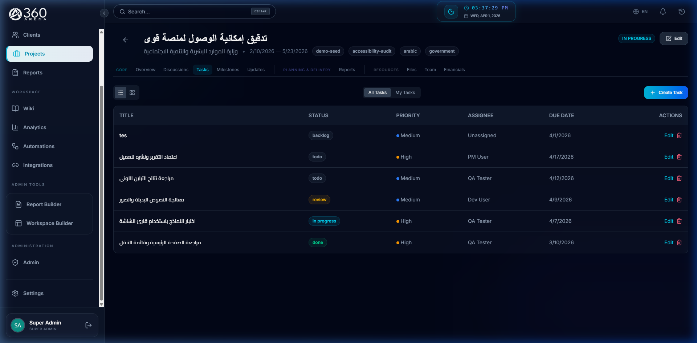
*Project Tasks Kanban | مهام المشروع - عرض كانبان*

### العربية
### أ) إضافة مهمة
1. افتح المشروع.
2. اذهب إلى `Tasks`.
3. اضغط `إضافة مهمة`.
4. أدخل العنوان والأولوية وتاريخ الاستحقاق والوصف.
5. احفظ.

### ب) تعيين المهمة
1. افتح تعديل المهمة.
2. اختر المسؤول من فريق المشروع.
3. احفظ.

### ج) تغيير الحالة
الخيار 1 (القائمة): تعديل المهمة وتغيير حقل الحالة.
الخيار 2 (كانبان): سحب بطاقة المهمة إلى عمود جديد.

تدفق الحالات الشائع:
`backlog -> todo -> in_progress -> review -> done`

---

## 10) Milestones: Add and Track | المعالم: إضافة ومتابعة

### EN
1. Open project.
2. Go to `Milestones`.
3. Click `Add Milestone`.
4. Add title, due date, status, completion percent.
5. Save.
6. Link tasks to milestone where needed.
7. Track completion progress over time.

### العربية
1. افتح المشروع.
2. اذهب إلى `Milestones`.
3. اضغط `إضافة معلم`.
4. أدخل العنوان وتاريخ الاستحقاق والحالة ونسبة الإنجاز.
5. احفظ.
6. اربط المهام بالمعلم عند الحاجة.
7. تابع نسبة الإنجاز مع الوقت.

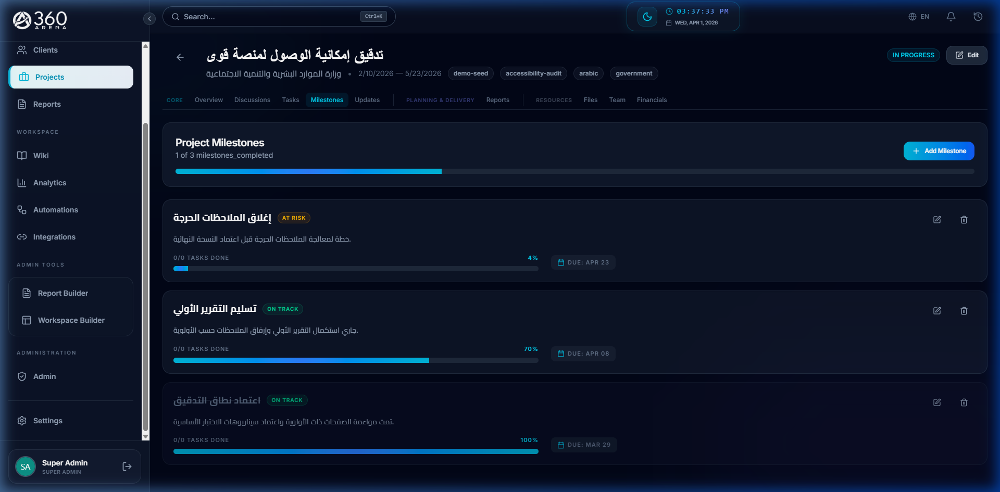
*Project Milestones | معالم المشروع*

---

## 11) Add Findings in Report | إضافة الملاحظات في التقرير

### EN
1. Open project.
2. Go to `Reports` and open report workspace.
3. Click `Add Audit Result`.
4. Fill outcome, category/subcategory, description, evidence, recommendation.
5. Save.

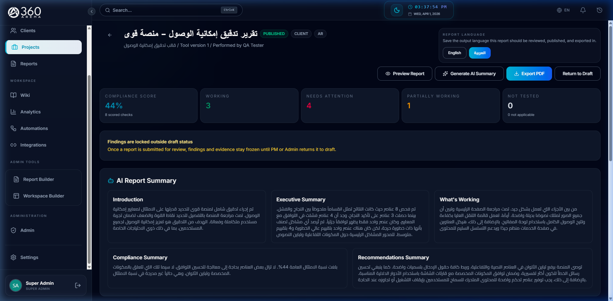
*Report Workspace Findings | الملاحظات الفنية في مساحة التقرير*

### العربية
1. افتح المشروع.
2. اذهب إلى `Reports` وافتح مساحة عمل التقرير.
3. اضغط `إضافة نتيجة تدقيق`.
4. أدخل النتيجة والتصنيف/التصنيف الفرعي والوصف والدليل والتوصية.
5. احفظ.

---

## 12) Generate AI Summary | إنشاء الملخص الذكي

### EN
1. In report workspace click `Generate AI Summary`.
2. Wait for completion.
3. Review narrative sections.
4. Edit where needed.
5. Save.

### العربية
1. في مساحة التقرير اضغط `إنشاء ملخص ذكي`.
2. انتظر حتى يكتمل.
3. راجع الأقسام النصية.
4. عدّل عند الحاجة.
5. احفظ.

---

## 13) Export Report PDF | تصدير التقرير PDF

### EN
1. Open final report.
2. Click `Export PDF`.
3. Confirm language and layout.
4. Download and share.

### العربية
1. افتح التقرير النهائي.
2. اضغط `تصدير PDF`.
3. تأكد من اللغة والتنسيق.
4. نزّل وشارك.

---

## 14) Advanced: Report Template Management | متقدم: إدارة قالب التقرير

### EN
Owner role: `SUPER_ADMIN`

1. Open `Admin > Report Builder`.
2. Create/open accessibility tool template.
3. Create new version.
4. Configure locale + categories.
5. Preview sample output.
6. Publish version.
7. Assign published version to client as `Default` + `Active`.

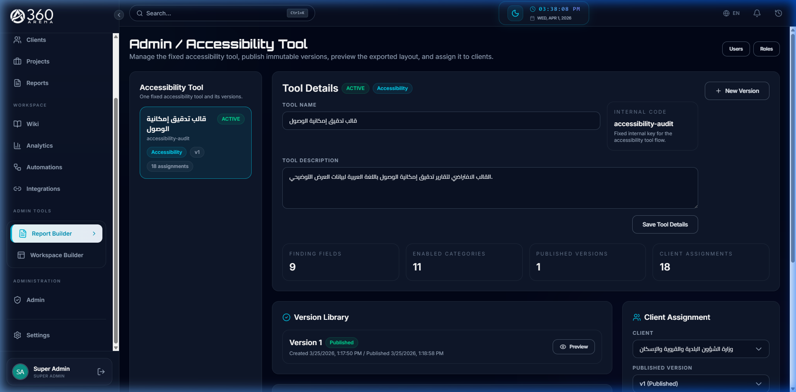
*Report Builder | منشئ التقارير*

### العربية
الدور المسؤول: `SUPER_ADMIN`

1. افتح `الإدارة > منشئ التقارير`.
2. أنشئ/افتح قالب أداة إمكانية الوصول.
3. أنشئ إصدارًا جديدًا.
4. اضبط اللغة والفئات.
5. راجع المعاينة.
6. انشر الإصدار.
7. أسند الإصدار المنشور للعميل كـ `افتراضي` و`نشط`.

---

## 15) Advanced: Workspace Tabs Template Management | متقدم: إدارة قالب تبويبات مساحة العمل

### EN
Owner roles: `SUPER_ADMIN`, `OPS`

1. Open `Admin > Workspace Builder`.
2. Create/select workspace template.
3. Set each tab mode:
   - hidden
   - read-only
   - interactive
4. Save template.
5. Assign template to client.
6. Verify on new project creation.

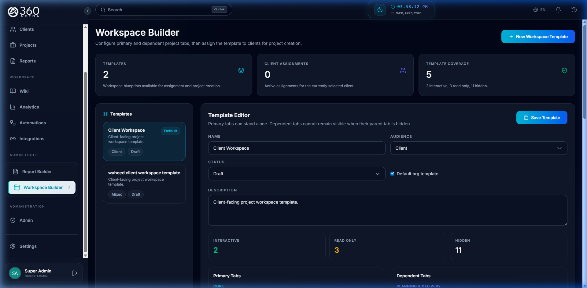
*Workspace Builder | منشئ مساحة العمل*

Project-level note:
- Project edit can override workspace snapshot for that project only.
- It does not change client global default assignment.

### العربية
الأدوار المسؤولة: `SUPER_ADMIN` و`OPS`

1. افتح `الإدارة > منشئ مساحة العمل`.
2. أنشئ/اختر قالب مساحة العمل.
3. حدّد وضع كل تبويب:
   - مخفي
   - قراءة فقط
   - تفاعلي
4. احفظ القالب.
5. أسند القالب للعميل.
6. تحقق عند إنشاء مشروع جديد.

ملاحظة على مستوى المشروع:
- تعديل المشروع يمكنه تغيير لقطة القالب لمشروع واحد فقط.
- لا يغيّر الإسناد الافتراضي العام للعميل.

---

## 16) Role Matrix (Who Can Do What) | مصفوفة الأدوار (من يستطيع ماذا)

### EN
| Role | Core capabilities |
|---|---|
| SUPER_ADMIN | Full platform administration |
| OPS | Client/project operations, workspace template assignment |
| PM | Project leadership, task/team/report operations |
| QA | Audit/report entry quality workflow |
| DEV | Task execution and report entry support |
| FINANCE | Financial visibility/operations |
| CLIENT_OWNER | Client-side full visibility for own client (incl. financial visibility) |
| CLIENT_MANAGER | Client-side visibility and report follow-up |
| CLIENT_MEMBER | Basic client-side participation and report viewing |

### العربية
| الدور | الصلاحيات الأساسية |
|---|---|
| SUPER_ADMIN | إدارة كاملة للمنصة |
| OPS | تشغيل العملاء/المشاريع وإسناد قوالب مساحة العمل |
| PM | قيادة المشروع وإدارة المهام/الفريق/التقارير |
| QA | سير عمل جودة نتائج التدقيق والتقارير |
| DEV | تنفيذ المهام ودعم مدخلات التقرير |
| FINANCE | عرض/تشغيل الجوانب المالية |
| CLIENT_OWNER | رؤية كاملة من طرف العميل لعميله (بما فيها المالية) |
| CLIENT_MANAGER | رؤية طرف العميل ومتابعة التقارير |
| CLIENT_MEMBER | مشاركة أساسية وقراءة التقارير |

---

## 17) Final Handover Checklist | قائمة التحقق النهائية للتسليم

### EN
- User owners and backups are defined.
- Invite and recovery process is documented.
- Role-permission model approved.
- Default report template assigned to each active client.
- Default workspace tabs template assigned to each active client.
- Naming convention for clients/projects/tasks is shared.
- Evidence quality rules are shared.
- Report approval and publish process is documented.
- Support contact and escalation path are documented.

### العربية
- تم تحديد ملاك المستخدمين والبدلاء.
- تم توثيق مسار الدعوة والاسترجاع.
- تم اعتماد نموذج الأدوار والصلاحيات.
- تم إسناد قالب التقرير الافتراضي لكل عميل نشط.
- تم إسناد قالب تبويبات مساحة العمل الافتراضي لكل عميل نشط.
- تمت مشاركة معيار التسمية للعملاء/المشاريع/المهام.
- تمت مشاركة قواعد جودة الأدلة.
- تم توثيق مسار اعتماد ونشر التقرير.
- تم توثيق جهة الدعم ومسار التصعيد.

---

## 18) Troubleshooting | حل المشاكل

### EN
- User cannot login: check invite status, active flag, role, and email.
- Missing tabs: check workspace template assignment + role visibility.
- Cannot edit report: check report permissions.
- AI summary failed: verify server/API configuration.
- Export issue: retry after refresh and confirm report language.

### العربية
- المستخدم لا يستطيع الدخول: تحقق من حالة الدعوة، حالة النشاط، الدور، والبريد.
- تبويبات غير ظاهرة: تحقق من قالب مساحة العمل وصلاحيات الدور.
- لا يمكن تعديل التقرير: تحقق من صلاحيات التقرير.
- فشل الملخص الذكي: تحقق من إعدادات الخادم/API.
- مشكلة التصدير: أعد المحاولة بعد تحديث الصفحة وتأكد من لغة التقرير.
